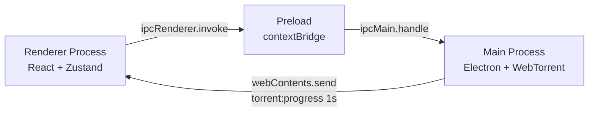

# Meshy

Cliente BitTorrent desktop multiplataforma construído com Electron, React e WebTorrent.


---

## 1. Descrição

Meshy é um cliente BitTorrent desktop com interface moderna inspirada no VS Code — tema escuro, navegação por Activity Bar e layout otimizado para teclado. Roda em **Windows**, **macOS** e **Linux** via Electron, usando WebTorrent como engine de download e React para a UI.

### Funcionalidades

- Adicionar torrents via arquivo `.torrent`, magnet link ou arrastar e soltar
- Pausar, retomar e remover downloads
- Seleção individual de arquivos dentro de um torrent
- Limites configuráveis de velocidade de download e upload e máximo de downloads simultâneos
- Progresso, velocidade e contagem de peers em tempo real (atualização a cada segundo)
- Persistência de sessão — downloads são restaurados ao reabrir o app
- Gerenciamento de trackers por torrent e favoritos globais
- Notificações nativas do sistema operacional ao concluir um download
- Temas customizáveis com aplicação dinâmica via variáveis CSS
- Internacionalização: `pt-BR` e `en-US`
- Configurações avançadas de rede: DHT, PEX, uTP

### Stack

| Camada       | Tecnologia                                                          |
| ------------ | ------------------------------------------------------------------- |
| Framework    | [Electron](https://www.electronjs.org/) 44                          |
| Build        | [electron-vite](https://electron-vite.org/) 5 + Vite 7              |
| UI           | [React](https://react.dev/) 19                                      |
| Estado       | [Zustand](https://zustand-demo.pmnd.rs/) 5                          |
| Torrent      | [WebTorrent](https://webtorrent.io/) 3                              |
| Persistência | [electron-store](https://github.com/sindresorhus/electron-store) 11 |
| i18n         | [react-intl](https://formatjs.github.io/docs/react-intl/) 12        |
| Linguagem    | TypeScript 7 (strict mode), API compatível 6 para Jest/ESLint       |
| Logging      | [electron-log](https://github.com/megahertz/electron-log) 5         |
| Testes       | Jest 30 + ts-jest + @testing-library/react 16                       |
| PBT          | [fast-check](https://fast-check.dev/) 4                             |
| Linting      | ESLint 10 + typescript-eslint 8                                     |
| Formatação   | Prettier 3                                                          |

**Pré-requisito:** Node.js >= 22.13

---

## 2. Arquitetura

Meshy segue o modelo de processos do Electron com isolamento estrito: o renderer nunca acessa Node.js diretamente.



- **Renderer** → chama `window.meshy.*` (API exposta pelo preload) via `ipcRenderer.invoke` para todas as operações
- **Preload** → ponte segura: expõe wrappers tipados sobre `ipcRenderer.invoke` via `contextBridge`
- **Main** → processa handlers `ipcMain.handle`, executa operações no WebTorrent e envia snapshots de progresso a cada segundo via `webContents.send('torrent:progress', items)`

Todos os handlers IPC retornam `IPCResponse<T>` — `{ success: true, data: T }` ou `{ success: false, error: string }`. Os tipos cruzados entre processos vivem exclusivamente em `shared/types.ts`.

---

## 3. Instalação e Desenvolvimento

**Pré-requisito:** Node.js >= 22.13

```bash
git clone <repository-url>
cd meshy
npm install
npm run dev
```

`npm run dev` inicia o Electron com hot reload via electron-vite. Alterações no renderer (React) são refletidas instantaneamente; alterações no processo principal reiniciam o Electron automaticamente.

### Outros comandos úteis

| Comando                 | Descrição                                 |
| ----------------------- | ----------------------------------------- |
| `npm test`              | Roda todos os testes com Jest             |
| `npm run test:watch`    | Testes em modo watch                      |
| `npm run test:coverage` | Relatório de cobertura de testes          |
| `npm run typecheck`     | Type-check completo (`tsc --noEmit`)      |
| `npm run lint`          | ESLint                                    |
| `npm run lint:fix`      | ESLint com auto-fix                       |
| `npm run format`        | Prettier --write                          |
| `npm run format:check`  | Prettier --check (sem modificar arquivos) |

---

## 4. Build de Produção

```bash
npm run build
```

Os artefatos são gerados em `out/`:

| Arquivo              | Descrição                    |
| -------------------- | ---------------------------- |
| `out/main/index.mjs` | Processo principal (Node.js) |
| `out/preload/`       | Script de preload            |
| `out/renderer/`      | Interface React (HTML + JS)  |

Para executar o build gerado:

```bash
npm start
```

---

## 5. Estrutura do Projeto

```
meshy/
├── main/
├── electron/
├── shared/
├── src/
├── tests/
└── docs/
```

| Pasta       | Responsabilidade                                                                                               |
| ----------- | -------------------------------------------------------------------------------------------------------------- |
| `main/`     | Processo principal Electron: engine WebTorrent, fila de downloads, persistência, handlers IPC, logs e métricas |
| `electron/` | Script de preload — expõe a API `window.meshy` ao renderer via `contextBridge` com isolamento de contexto      |
| `shared/`   | Código compartilhado entre main e renderer: tipos (`types.ts`), validações, formatadores e códigos de erro     |
| `src/`      | Processo renderer React: componentes, hooks, stores Zustand, temas, i18n e estilos                             |
| `tests/`    | Testes Jest: unitários (`tests/unit/`) e de integração (`tests/integration/`)                                  |
| `docs/`     | Documentação do projeto e roteiros de manutenção                                                               |

### Configuração TypeScript

O projeto usa referências compostas com quatro configs:

- `tsconfig.node.json` — main + preload + shared (target ES2022)
- `tsconfig.web.json` — renderer + shared (target ES2020, JSX react-jsx)
- `tsconfig.jest.json` — testes (NodeNext, saída CommonJS, módulos isolados)
- `tsconfig.json` — raiz com referências; `npm run typecheck` verifica os três projetos explicitamente

`npx tsc` executa o TypeScript 7 nativo. O alias `typescript` fornece a API do
TypeScript 6 para `ts-jest` e `typescript-eslint`; `npx tsc6` executa esse compilador
compatível. Veja as [decisões da atualização de dependências](docs/DEPENDENCY_UPDATES.md).

---

## 6. Como Contribuir

Antes de abrir um PR, execute as três verificações obrigatórias e certifique-se de que todas passam sem erros:

```bash
npm run lint
npm run format:check
npm test -- --runInBand
```

- **`npm run lint`** — zero erros de ESLint
- **`npm run format:check`** — código formatado conforme `.prettierrc`
- **`npm test -- --runInBand`** — todos os testes passando

Para type-check explícito dos três projetos:

```bash
npx tsc --noEmit -p tsconfig.node.json
npx tsc --noEmit -p tsconfig.web.json
npx tsc --noEmit -p tsconfig.jest.json
```

Convenções de código: quatro espaços, aspas simples, ponto e vírgula, trailing commas e largura de 100 caracteres (`.prettierrc`). Nomes de símbolos e APIs seguem o padrão existente — evite refatorações amplas em PRs pontuais.

---

## Licença

[MIT](LICENSE)
